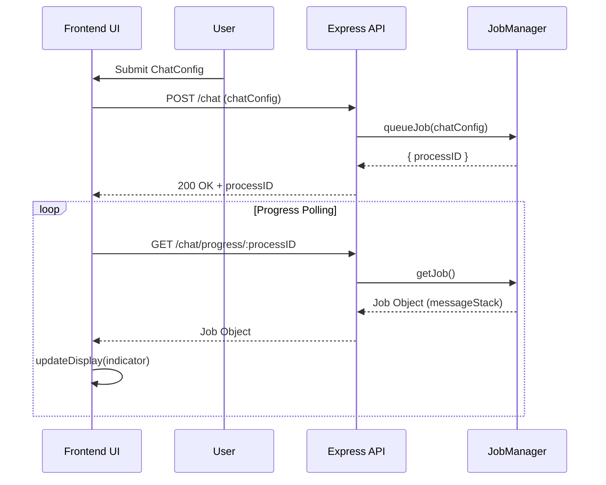

Awesome — here's a clean, structured **overview documentation** of your frontend architecture and how it communicates with your API. It’s written in the tone of a real-world project README, highlighting the unique design choices you made.

---

# 🧠 NOA Frontend Architecture Overview

> *Process-Driven UI Feedback Architecture (PD-UFA)*

## 📌 Overview

This frontend system is designed to interact with a job-based API in a **reactive, stateful** way. It tracks backend processes using **process IDs** and updates the UI in real time via a persistent **indicator system**.

Instead of a one-shot fetch model, this architecture leverages **persistent state**, **structured feedback**, and **status indicators** to display API progress dynamically.

---

## 🏗️ Core Architectural Flow



---

## 🧩 Modules Breakdown

### 1. `useIndicatorManager.js`

Manages local UI indicators used to track progress or state of backend jobs.

* `displayIndicator(indicator: IndicatorObject)`
* `toggleStatus(id: string)`
* `updateDisplay(update: DisplayUpdate)`
* `context.indicators`: reactive array of active indicators

Each `IndicatorObject` is reactive and validates its structure using `shallowTypeCheck`.

### 2. `JobManager.js`

Handles backend job queuing and tracking.

* `queueJob(chatConfig: ChatConfig): string` → creates a job with a unique `processID`
* `getJob(processID: string): Job`
* `clearJobMessageStack(job: Job | processID)`

Jobs contain a `messageStack` of `DisplayUpdate` objects that inform the UI what to display and how.

### 3. API Endpoints

* `POST /chat`
  Submits a new chat job. Returns a `processID` used for tracking.

* `GET /chat/progress/:processID`
  Retrieves the job’s current progress and returns any new `DisplayUpdate` messages. These are **dequeued** after sending to ensure clean update cycles.

---

## 🧠 Design Principles

### ✅ State-Driven UI

The frontend state drives what the user sees — not API responses directly. This means the UI **can stay in sync** even across re-renders or reconnects.

### 🧩 Modular & Observable

State is managed in isolated modules (`useIndicatorManager`, etc), which makes them **testable**, **traceable**, and **observable** (via `$inspect`).

### 🔁 Loop-Safe Feedback

No repeated or flickering updates — once a message is sent from the API and processed by the frontend, it is cleared from the backend's `messageStack`.

---

## 🧪 Typedefs

```js
/**
 * @typedef {"search" | "file"} Modifier
 * @typedef {Array<Modifier>} ModiferList
 */

/**
 * @typedef {object} ChatConfig
 * @property {ModiferList} modifiers
 * @property {string} prompt
 * @property {string} promptRole
 */

/**
 * @typedef {Object} IndicatorObject
 * @property {string} id
 * @property {string} [icon]
 * @property {string} message
 * @property {boolean} status
 */

/**
 * @typedef {Object} DisplayUpdate
 * @property {'display'} updateType
 * @property {IndicatorObject} indicator
 */

/**
 * @typedef {Object} Job
 * @property {string} processID
 * @property {boolean} status
 * @property {Array<DisplayUpdate>} messageStack
 */
```

---

## 💡 Why This Is Special

* Unlike traditional fetch-UIs, this system **retains process state** over time.
* You can build features like:

  * Cancel jobs
  * Rehydrate indicators on reload
  * Build dashboards that reflect backend states in real time

---
